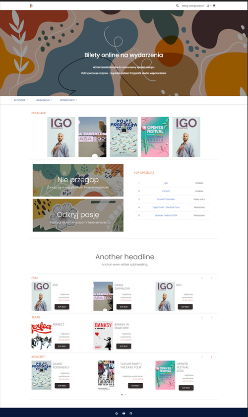
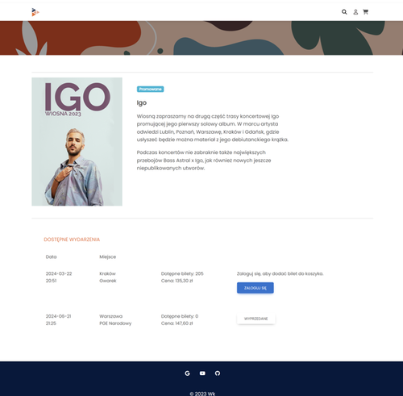
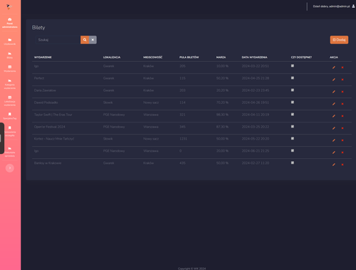
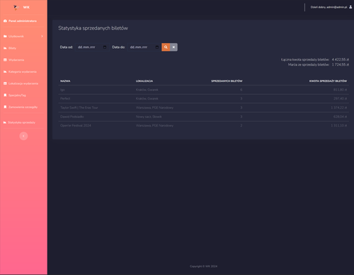

# Zarządzanie Wydarzeniami Kulturalnymi - Aplikacja Webowa

## Opis projektu
W ramach pracy inżynierskiej zaprojektowałam aplikację webową do zarządzania wydarzeniami kulturalnymi. Aplikacja została opracowana w języku C# z wykorzystaniem wzorca MVC (Model-Widok-Kontroler) i ma na celu:

- **Umożliwienie** użytkownikom rezerwacji i zakupu biletów na wydarzenia kulturalne oraz dostęp do bazy zakupionych biletów z poziomu panelu użytkownika.
- **Dostarczenie** administratorom funkcji zarządzania danymi, dostęp do statystyk sprzedaży oraz podsumowań finansowych.

## Zakres pracy
- **Architektura**: Opracowanie aplikacji zgodnie ze wzorcem MVC, zapewniającym separację logiki biznesowej, interfejsu użytkownika i zarządzania danymi.
- **Backend**: Rozwój w języku C#, w tym logika biznesowa, autoryzacja oraz zarządzanie bazą danych MySQL.
- **Frontend**: Tworzenie interfejsu użytkownika przy użyciu CSS, Bootstrap i JavaScript dla intuicyjnej obsługi aplikacji.
- **Funkcjonalności**: Implementacja autoryzacji, uwierzytelniania, rejestracji, logowania, filtrowania, pobierania danych biletów, tworzenia zamówień oraz zarządzania panelem administratora.

## Oczekiwane rezultaty
Funkcjonalna i bezpieczna aplikacja webowa, która usprawni zarządzanie wydarzeniami kulturalnymi i poprawi dostępność kultury. 

### Widok strony głównej aplikacji:

 
[Zobacz pełną wersję](https://github.com/DominikaGargula/WydarzeniaKulturale/blob/main/Strona_Glowna.png)

### Widok szczegółów biletu:

 
[Zobacz pełną wersję](https://github.com/DominikaGargula/WydarzeniaKulturale/blob/main/Bilety_DetailsCard.png)

### Widok administratora aplikacji:

 
[Zobacz pełną wersję](https://github.com/DominikaGargula/WydarzeniaKulturale/blob/main/Home_AdminPanel.png)

### Widok administrator - zarządzanie biletami
 
[Zobacz pełną wersję](https://github.com/DominikaGargula/WydarzeniaKulturale/blob/main/Admin_Bilety.png)

### Widok administrator - Statystyka sprzedaży

 
[Zobacz pełną wersję](https://github.com/DominikaGargula/WydarzeniaKulturale/blob/main/Admin_FinalizacjaKoszyka_StatystykaSprzedazy.png)
