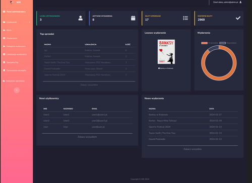

# Cultural Event Management - Web Application / Zarządzanie Wydarzeniami Kulturalnymi - Aplikacja Webowa

## Project Description / Opis projektu
As part of my engineering thesis, I designed a web application for managing cultural events. The application was developed in C# using the MVC (Model-View-Controller) pattern and aims to:

W ramach pracy inżynierskiej zaprojektowałam aplikację webową do zarządzania wydarzeniami kulturalnymi. Aplikacja została opracowana w języku C# z wykorzystaniem wzorca MVC (Model-Widok-Kontroler) i ma na celu:

- **Enable / Umożliwienie** users to reserve and purchase tickets for cultural events and access a database of purchased tickets from the user panel.
- **Provide / Dostarczenie** administrators with data management functions, access to sales statistics, and financial summaries.

## Scope of Work / Zakres pracy
- **Architecture / Architektura**: Development of the application according to the MVC pattern, ensuring the separation of business logic, user interface, and data management. / Opracowanie aplikacji zgodnie ze wzorcem MVC, zapewniającym separację logiki biznesowej, interfejsu użytkownika i zarządzania danymi.
- **Backend / Backend**: Development in C#, including business logic, authorization, and management of a MySQL database. / Rozwój w języku C#, w tym logika biznesowa, autoryzacja oraz zarządzanie bazą danych MySQL.
- **Frontend / Frontend**: Creating the user interface using CSS, Bootstrap, and JavaScript for intuitive application handling. / Tworzenie interfejsu użytkownika przy użyciu CSS, Bootstrap i JavaScript dla intuicyjnej obsługi aplikacji.
- **Functionalities / Funkcjonalności**: Implementation of authorization, authentication, registration, login, filtering, ticket data retrieval, order creation, and administration panel management. / Implementacja autoryzacji, uwierzytelniania, rejestracji, logowania, filtrowania, pobierania danych biletów, tworzenia zamówień oraz zarządzania panelem administratora.

## Expected Results / Oczekiwane rezultaty
A functional and secure web application that streamlines the management of cultural events and improves access to culture. / Funkcjonalna i bezpieczna aplikacja webowa, która usprawni zarządzanie wydarzeniami kulturalnymi i poprawi dostępność kultury.

### View of the application's main page: / Widok strony głównej aplikacji:

*Higher resolution: [View](https://github.com/DominikaGargula/WydarzeniaKulturale/blob/main/Strona_Glowna.png) / Większa rozdzielczość: [Zobacz](https://github.com/DominikaGargula/WydarzeniaKulturale/blob/main/Strona_Glowna.png)*

### View of ticket details: / Widok szczegółów biletu:

*Higher resolution: [View](https://github.com/DominikaGargula/WydarzeniaKulturale/blob/main/Bilety_DetailsCard.png) / Większa rozdzielczość: [Zobacz](https://github.com/DominikaGargula/WydarzeniaKulturale/blob/main/Bilety_DetailsCard.png)*

### View of the application administrator: / Widok administratora aplikacji:

*Higher resolution: [View](https://github.com/DominikaGargula/WydarzeniaKulturale/blob/main/Home_AdminPanel.png) / Większa rozdzielczość: [Zobacz](https://github.com/DominikaGargula/WydarzeniaKulturale/blob/main/Home_AdminPanel.png)*

### View of the administrator - ticket management: / Widok administrator - zarządzanie biletami:

*Higher resolution: [View](https://github.com/DominikaGargula/WydarzeniaKulturale/blob/main/Admin_Bilety.png) / Większa rozdzielczość: [Zobacz](https://github.com/DominikaGargula/WydarzeniaKulturale/blob/main/Admin_Bilety.png)*

### View of the administrator - Sales Statistics: / Widok administrator - Statystyka sprzedaży:

*Higher resolution: [View](https://github.com/DominikaGargula/WydarzeniaKulturale/blob/main/Admin_FinalizacjaKoszyka_StatystykaSprzedazy.png) / Większa rozdzielczość: [Zobacz](https://github.com/DominikaGargula/WydarzeniaKulturale/blob/main/Admin_FinalizacjaKoszyka_StatystykaSprzedazy.png)*
